# Лабораторная работа №4

Выполнил Панков Никита, ББМО-01-23

## Создание пары GPG

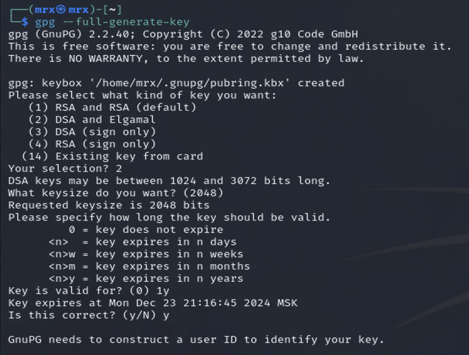
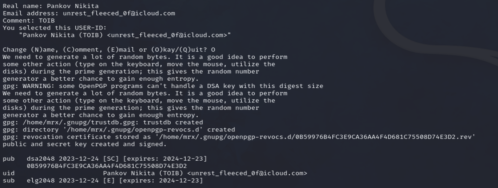

## Просмотр только что созданной пары GPG

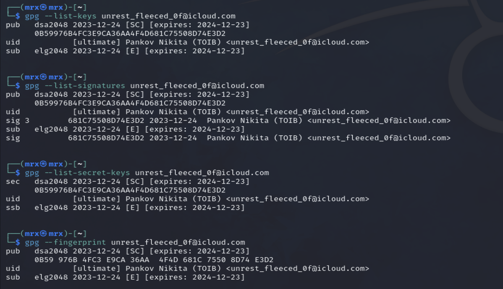

## Создание отзывающего сертификата

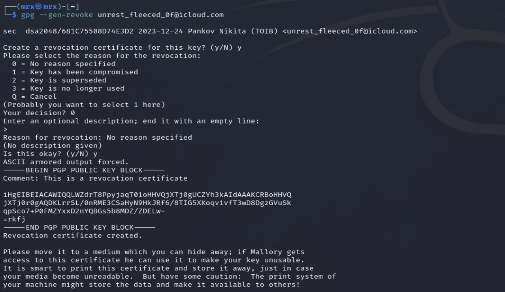

## Запись сертификата в файл: 

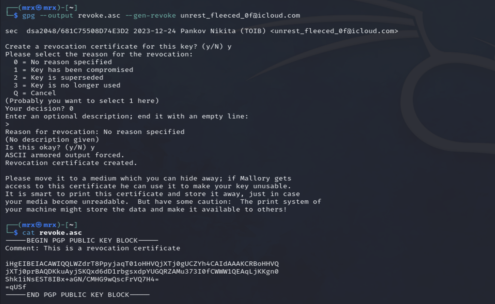

## Экспорт публичного ключа в бинарном и текстовом виде

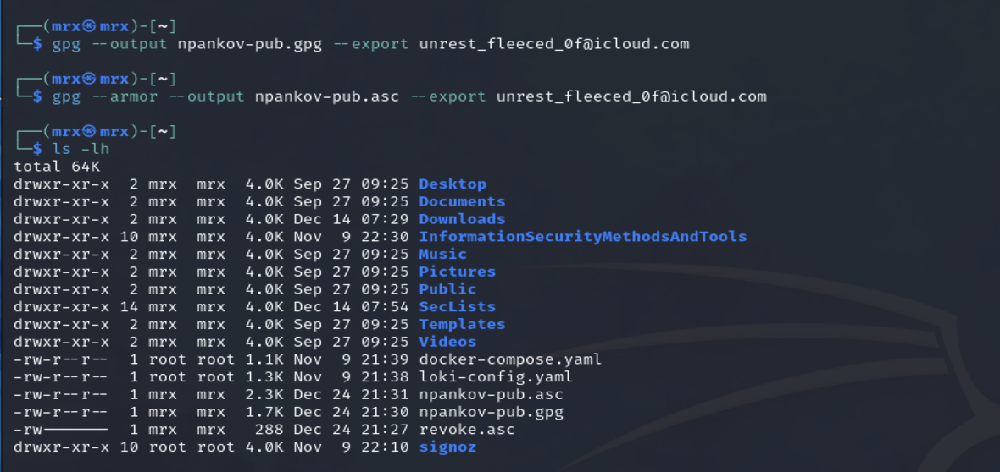
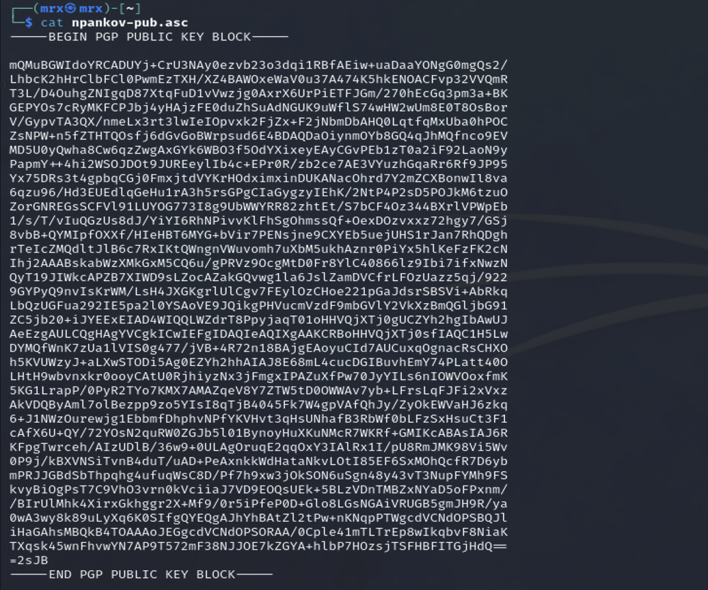
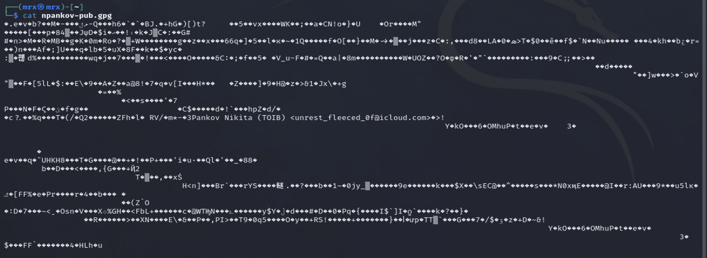

## Создание файла для подписи

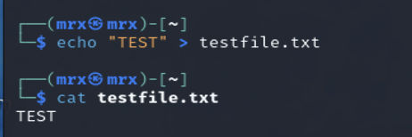

## Создание подписи в бинарном виде

## Проверка подписи

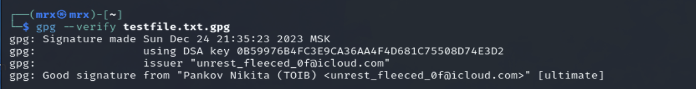

## Создание подписи в формате ASCII

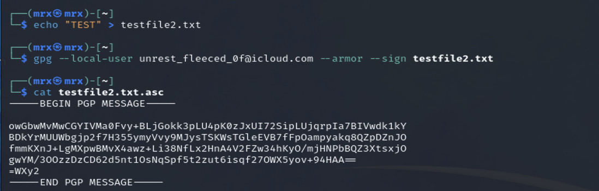

## Создание подписи, вставленной в содержимое файла

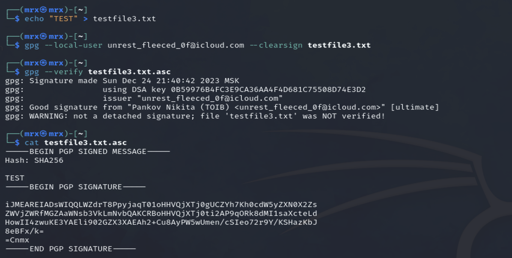
